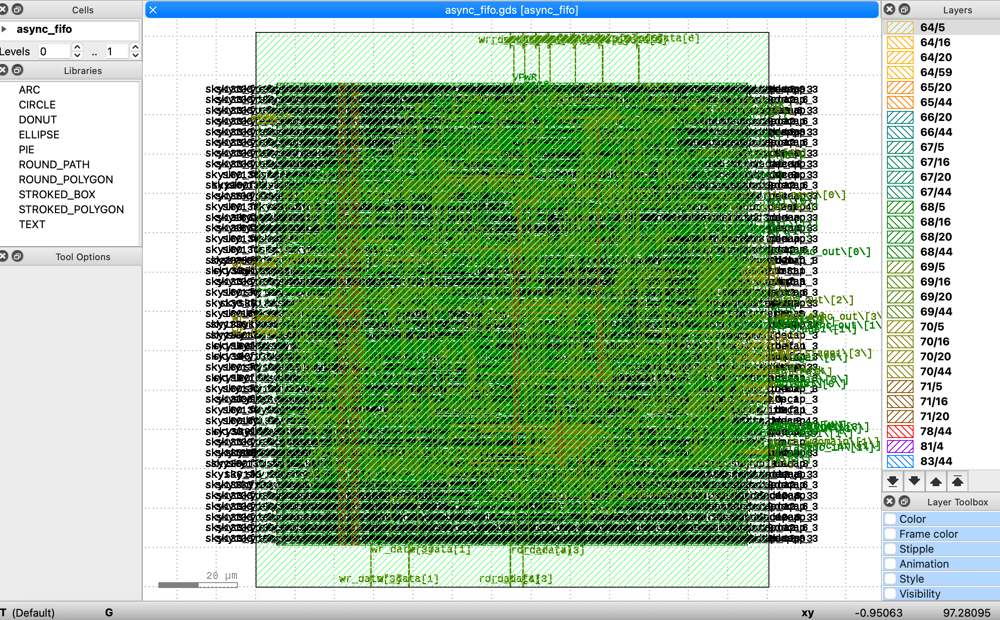

# CDC-Safe Asynchronous FIFO

A parameterized asynchronous FIFO that safely moves data between two independent, unrelated clock domains using Gray-coded pointers and 2-flip-flop synchronizers — taken all the way from RTL through a manufacturable GDSII layout.

## Why this project

Real chips constantly move data between blocks running at different, unrelated clock frequencies — a CPU writing to a sensor interface running at a completely different speed, for example. Doing that safely, without metastability silently corrupting data, is one of the most fundamental problems in digital design and one of the most commonly asked about in interviews.

## Physical layout



This is the actual chip — generated by running the design through OpenLane's full physical design flow on the SkyWater SKY130 process. Every shape here is a real transistor, wire, or via, exactly as it would sit on manufactured silicon.

## Architecture

Write domain (wclk)              Read domain (rclk)
    write pointer   ──gray code──▶  2FF synchronizer (empty check)
    (Gray-coded)

    2FF synchronizer (full check)  ◀──gray code──  read pointer
                                                    (Gray-coded)

                both sides share: dual-port memory

## Key design decisions

- **Gray code, not binary, for the pointers** — a binary counter can flip multiple bits at once on a single increment (`011→100`), and a synchronizer catching that mid-transition could grab a corrupted mix of old and new bits. Gray code guarantees only one bit ever changes per step, so a synchronizer always sees either the fully-old or fully-new value.
- **2 flip-flops, not 1, for synchronization** — the first flop is the one that can actually go metastable when sampling a signal from a clock it has no fixed relationship to. The second flop, sampling one cycle later, catches it after it's had time to settle.
- **Pointer is one bit wider than needed** — without this, "full" and "empty" look identical (write pointer == read pointer either way). The extra bit lets the logic tell "nothing written yet" apart from "write pointer has wrapped exactly once more than read pointer."
- **Registered memory read** — costs one cycle of latency but avoids read-during-write glitches and matches how real SRAM/BRAM behaves.

## Verification

Simulated with two genuinely unrelated clock periods (wclk = 10ns, rclk = 7ns) to actually stress the CDC logic instead of just going through the motions. Filled the FIFO completely, confirmed writes get ignored once full, drained it from the independent read side with every value landing correctly and in order, confirmed empty flag after drain. 18/18 checks pass.

```bash
iverilog -o sim/fifo_sim.vvp rtl/gray_ptr.v rtl/sync2ff.v rtl/dual_port_mem.v rtl/async_fifo.v tb/async_fifo_tb.v
vvp sim/fifo_sim.vvp
```

## Synthesis

Synthesized cleanly with Yosys — 112 cells, 46 flip-flops, one inferred 128-bit memory, zero errors. Details in `docs/SYNTHESIS_REPORT.md`.

## Physical design

Taken through the complete OpenLane flow (floorplan → placement → clock tree synthesis → routing → signoff) targeting SKY130. Since the design has two truly asynchronous clocks, a custom SDC (`fifo.sdc`) defines both and marks them as an asynchronous clock group, so the timing tool doesn't try to check paths between them — that safety is handled structurally by the synchronizers instead.

Result: 0 DRC errors, 0 LVS mismatches, 0 antenna violations, timing closes with positive slack across all 9 PVT corners. Full breakdown in `docs/PHYSICAL_DESIGN_REPORT.md`.

## Files
- `rtl/gray_ptr.v` — binary + Gray-code pointer generator
- `rtl/sync2ff.v` — 2-flip-flop CDC synchronizer
- `rtl/dual_port_mem.v` — dual-port FIFO storage
- `rtl/async_fifo.v` — top-level module
- `tb/async_fifo_tb.v` — testbench with two independent clocks
- `synth/synth.ys` — Yosys synthesis script
- `config.json`, `fifo.sdc` — OpenLane physical design configuration